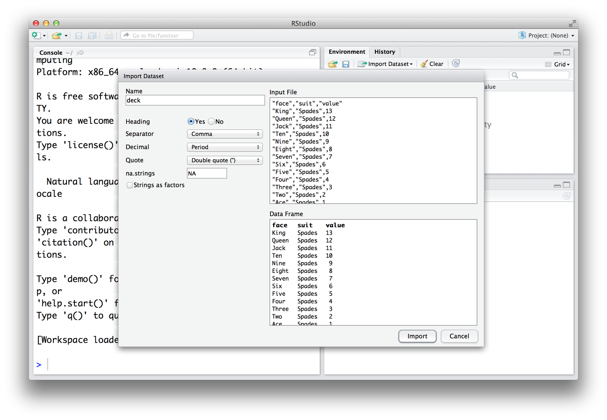
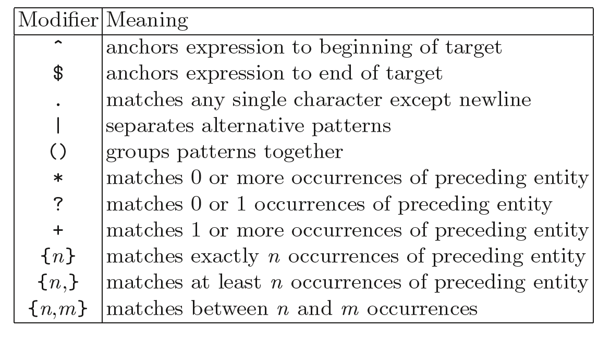

<!-- TOC depthFrom:1 depthTo:6 withLinks:1 updateOnSave:1 orderedList:0 -->

- [Resources](#resources)
- [Basics](#basics)
	- [Interface](#interface)
	- [Writing commands in the console](#writing-commands-in-the-console)
- [Objects (Part I)](#objects-part-i)
	- [Vectors](#vectors)
	- [an alternative way of creating a range of values is using the character :](#an-alternative-way-of-creating-a-range-of-values-is-using-the-character-)
- [Functions](#functions)
	- [Writing your own functions](#writing-your-own-functions)
	- [Scripts](#scripts)
- [Objects (Part II)](#objects-part-ii)
	- [Vectors](#vectors)
	- [get size of vector](#get-size-of-vector)
- [operations with vectors](#operations-with-vectors)
	- [selecting elements in the vector](#selecting-elements-in-the-vector)
- [example: characters](#example-characters)
	- [Matrices](#matrices)
	- [Factors](#factors)
	- [Lists](#lists)
	- [Data Frames](#data-frames)
		- [Loading data](#loading-data)
		- [Exploring data](#exploring-data)
		- [Selecting values](#selecting-values)
		- [Removing missing values and duplicates](#removing-missing-values-and-duplicates)
	- [or](#or)
		- [Ordering](#ordering)
		- [Creating data frames from other objects](#creating-data-frames-from-other-objects)
		- [Merging data frames](#merging-data-frames)
		- [Concatenating data frames](#concatenating-data-frames)
		- [Appending Rows](#appending-rows)
		- [Appending Columns](#appending-columns)
		- [Function `apply`](#function-apply)
	- [get the mean value for each row](#get-the-mean-value-for-each-row)
	- [get the mean value for each column](#get-the-mean-value-for-each-column)
		- [Writing data](#writing-data)
- [Loops and if/else statements](#loops-and-ifelse-statements)
	- [`For` loop](#for-loop)
	- [`while` loop](#while-loop)
		- [Example](#example)
	- [If-else statements](#if-else-statements)
	- [](#)
		- [](#)
- [Visualization](#visualization)
	- [Quick data exploration](#quick-data-exploration)
		- [Scatter plot](#scatter-plot)
		- [Line graph](#line-graph)
	- [with ggplot2](#with-ggplot2)
		- [Bar graph](#bar-graph)
	- [](#)
- [Bar graph of counts This uses the mtcars data frame, with the "cyl" column for](#bar-graph-of-counts-this-uses-the-mtcars-data-frame-with-the-cyl-column-for)
- [x position. The y position is calculated by counting the number of rows for](#x-position-the-y-position-is-calculated-by-counting-the-number-of-rows-for)
- [each value of cyl.](#each-value-of-cyl)
- [Bar graph of counts](#bar-graph-of-counts)
		- [Histogram](#histogram)
	- [ggplot2](#ggplot2)
		- [Boxplot](#boxplot)
	- [option 1](#option-1)
- [Formula syntax](#formula-syntax)
- [Put interaction of two variables on x-axis](#put-interaction-of-two-variables-on-x-axis)
	- [ggplot2](#ggplot2)
		- [More advanced features](#more-advanced-features)
- [Working with text](#working-with-text)
	- [Basics of character manipulation](#basics-of-character-manipulation)
	- [Regular Expressions](#regular-expressions)
		- [List of Regular Expression Functions](#list-of-regular-expression-functions)
	- [find all occurrences of the word 'and'](#find-all-occurrences-of-the-word-and)
	- [find all occurrences of the word 'city'](#find-all-occurrences-of-the-word-city)
		- [Modifiers](#modifiers)

<!-- /TOC -->


# Resources

This tutorial is based on:
* https://rstudio-education.github.io/hopr/
* https://r-graphics.org/
* Crawley, Michael J. The R Book, Second Edition. Wiley.
* Spector, Phil. Data Manipulation with R. Springer


# Basics

## Interface


* console
* environment
* history
* files
* plots
* etc

## Writing commands in the console

* R as a calculator

```
> 1 + 1
[1] 2
> 19 * 53
[1] 1007
> 45/2
[1] 22.5
> 987 - 653
[1] 334
```

* incomplete commands
* commands that R doesn't recognize


# Objects (Part I)

* What is an object? Just a name that you can use to call up stored data

```
> a <- 10
> a
[1] 10
> a + 20
[1] 30
> a - 4
[1] 6
> a * 89
[1] 890
```

* two ways of assigning values to an object

```
a <- 10
a = 10
```

* in programming languages the sign `=` has a different meaning than in mathematical formulas

```
> a = 89 # the object a receives the value 89
> a == 89 # asks if the value in object a is equal to 89
[1] TRUE
```

* the character `#` allows us to put comments on codes
* You can name an object in R almost anything you want, but there are a few rules. First, a name cannot start with a number. Second, a name cannot use some special symbols, like `^`, `!`, `$`, `@`, `+`, `-`, `/`, or `*`
* R is case-sensitive
* R will overwrite any previous information stored in an object without asking you for permission

## Vectors

```
> die <- c(1,2,3,4,5,6)
> die
[1] 1 2 3 4 5 6
## an alternative way of creating a range of values is using the character :
> die <- 1:6
> die
[1] 1 2 3 4 5 6
```

# Functions

* functions are a piece of re-usable code
* you give a *input* to a function (**argument**), it will perform a *task*, and return the *output*
* R comes with several functions (built-in functions) or you can write your own
* some examples:

```
> round(6.89)
[1] 7
> sqrt(98)
[1] 9.899495
> exp(7.8)
[1] 2440.602
> mean(1:6)
[1] 3.5
> median(1:6)
[1] 3.5
```

* some functions have multiple arguments
* example: let's get two random values from the interval 1 to 100
      * getting help: `?sample`


```
> sample(x = 1:100, 2)
[1] 12 59
> sample(x = 1:100, 2)
[1] 98 33
> sample(x = 1:100, 2)
[1] 72 80
> sample(x = 1:100, 2)
[1] 32 15
> sample(x = 1:100, 2, replace = TRUE)
[1]  4 40
```


## Writing your own functions

* the structure

```
roll <- function() {
  die <- 1:6
  dice <- sample(die, size = 2, replace = TRUE)
  sum(dice)
}
```

* Notice indentation (or blank lines)

```
> roll()
[1] 4
```


## Scripts

* You can create a draft of your code as you go by using an R script


# Objects (Part II)

## Vectors

* length, operations, and selection of elements

```
## get size of vector
> length(v)
[1] 5
# operations with vectors
> v <- c(10,8,9,13,20)
> v * 2
[1] 20 16 18 26 40
> v + 10
[1] 20 18 19 23 30
> v / 3
[1] 3.333333 2.666667 3.000000 4.333333 6.666667
## selecting elements in the vector
> v[1]
[1] 10
> v[2]
[1] 8
> v[5]
[1] 20
```

* We can store different types of variables in vectors: integer, float, character, and logicals

```
# example: characters
> text <- c("Hello",  "World")
> text
[1] "Hello" "World"
> ##  "Hello"  "World"
```

## Matrices

Matrices store values in a two-dimensional array, just like a matrix from linear algebra. To create one, first give matrix an atomic vector to reorganize into a matrix. Then, define how many rows should be in the matrix by setting the `nrow` argument to a number. `matrix` will organize your vector of values into a matrix with the specified number of rows. Alternatively, you can set the `ncol` argument, which tells R how many columns to include in the matrix

```
> matrix(1:6,ncol = 2)
     [,1] [,2]
[1,]    1    4
[2,]    2    5
[3,]    3    6
> matrix(1:6,nrow = 2)
     [,1] [,2] [,3]
[1,]    1    3    5
[2,]    2    4    6
```


## Factors

Factors are R’s way of storing categorical information, like ethnicity or eye color

```
> type_of_sample <- c('control', 'infected', 'control', 'infected')
> type_of_sample <- factor(type_of_sample)
> type_of_sample
[1] control  infected control  infected
Levels: control infected
```


## Lists


Lists are like vectors, besides grouping together individual values they can also group together R objects, such as atomic vectors and other lists.

```
> list1 <- list(100:130, "R", list(TRUE, FALSE))
> list1
[[1]]
 [1] 100 101 102 103 104 105 106 107 108 109 110 111 112 113 114 115 116 117 118 119 120 121 122 123 124 125 126 127
[29] 128 129 130

[[2]]
[1] "R"

[[3]]
[[3]][[1]]
[1] TRUE

[[3]][[2]]
[1] FALSE
```

* `unlist` function

```
a <- list ("x"=5, "y"=10, "z"=15)

```

## Data Frames

You can think of a data frame as R’s equivalent to the Excel spreadsheet because it stores data in a similar format. Data frames store data as a sequence of columns. Each column can be a different data type

```
> df <- data.frame(face = c("ace", "two", "six"),  
+                  suit = c("clubs", "clubs", "clubs"), value = c(1, 2, 3))
> df
  face  suit value
1  ace clubs     1
2  two clubs     2
3  six clubs     3

> df$face
[1] ace two six
Levels: ace six two
> df$suit
[1] clubs clubs clubs
Levels: clubs
> df$value
[1] 1 2 3
```

### Loading data


* Import Dataset Icon



* Command Line

```
dt = read.csv('data/toy_expression_data.csv')
> head(dt)
    patient1   patient2   patient3   patient4  patient5
1  0.4751667  0.8143333  1.4279167  0.9551667 0.2622500
2  0.3825000  0.4890000  0.4555000 -0.1055000 0.0620000
3  0.2796667  0.7806667  0.6601667  1.4023333 0.7856667
4  0.2527500  0.5162500  0.5335000 -0.0663750 0.3468750
5  0.6032500  0.7092500  1.2082500  1.4860000 0.4482500
6 -0.1330000 -0.4463333 -0.1006667 -0.4160000 0.1648333
```


### Exploring data

```
head(dt)
tail(dt)
ncol(dt)
nrow(dt)
dim(dt)
rownames(dt)
colnames(dt)
summary(dt)
```

### Selecting values


To extract a value or set of values from a data frame, write the data frame’s name followed by a pair of hard brackets

```
dt[ , ]
```

1. Using integers

```
dt[1:10,2]
dt[10:20,c(2,3)]
```

2. Using negative integers

Negative integers do the exact opposite of positive integers when indexing. R will return every element except the elements in a negative index

```
dt[-1:-10,c(2,3)]
```

3. Blank spaces

You can use a blank space to tell R to extract every value in a dimension


4. Names

```
dt[1:10, c('patient1','patient2')]
```


5. Dollar sign

* To select a column from a data frame, write the data frame’s name and the column name separated by a `$`

6. Logical subsetting

| Operator |       Syntax      |               Tests              |
|:--------:|:-----------------:|:--------------------------------:|
|     >    |       a > b       |       Is a greater than b?       |
|    >=    |       a >= b      | Is a greater than or equal to b? |
|     <    |       a < b       |         Is a less than b?        |
|    <=    |       a <= b      |   Is a less than or equal to b?  |
|    ==    |       a == b      |         Is a equal to b?         |
|    !=    |       a != b      |       Is a not equal to b?       |
|   %in%   | a %in% c(a, b, c) |   Is a in the group c(a, b, c)?  |


```
dt[dt$patient1 > dt$patient2,c(1,2)]
dt[,colnames(dt) %in% c('patient1','patient2')]

```

**Boolean operators**


| Operator |             Syntax            |                             Tests                             |
|:--------:|:-----------------------------:|:-------------------------------------------------------------:|
|     &    |         cond1 & cond2         |                 Are both cond1 and cond2 true?                |
|     \|    |         cond1 \| cond2         |            Is one or more of cond1 and cond2 true?            |
|    xor   |       xor(cond1, cond2)       |            Is exactly one of cond1 and cond2 true?            |
|     !    |             !cond1            | Is cond1 false? (e.g., ! flips the results of a logical test) |

```
dt[dt$patient1 < -0.5 | dt$patient1 > 0.5,]
dt[dt$patient1 < -0.5 & dt$patient2 < -0.5,]
dt[!dt$patient1 < 0,1]

```

### Removing missing values and duplicates

* Removing missing values (`NA`)

```
dt = read.csv('data/WormDensityDataSet.csv')
dt_red = na.omit(dt)
## or
dt_red = dt[complete.cases(dt),]
```

* Replace `NA` with zeros

```
dt[is.na(dt)] = 0
```

* Dealing with duplicated values

```
dt[duplicated(dt),]
dt[!duplicated(dt),]
```

### Ordering

```
dt[order(dt$Vegetation),]
```

### Creating data frames from other objects

```
x = c(1,2,3)
y = c(10,23,78)
df = data.frame(x,y)
df
```

### Merging data frames

```
hb = read.csv('data/Herbicides.csv')
merged = merge(dt, hb, by.x = 'Vegetation', by.y = 'Type')
```

### Concatenating data frames


```
### Appending Rows
d1 = dt[dt$Vegetation == 'Grassland',]
d2 = dt[dt$Vegetation == 'Meadow',]
rbind(d1,d2)
### Appending Columns
temperature = c(20,25,19)
cbind(d2, temperature)
```

###  Function `apply`

```
dt = read.csv('data/toy_expression_data.csv')
## get the mean value for each row
apply(dt[,-1],1,mean)
## get the mean value for each column
apply(dt[,-1],2,mean)
```


### Writing data

```
write.csv(merged, 'output.csv')
```

# Loops and if/else statements

## `For` loop

* you request that an index, `i`, takes on a sequence of values, and that one or more lines of commands are executed as many times as there are different values of `i`.

```
> for (i in 1:15){
+   print (i)
+ }
[1] 1
[1] 2
[1] 3
[1] 4
[1] 5
[1] 6
[1] 7
[1] 8
[1] 9
[1] 10
[1] 11
[1] 12
[1] 13
[1] 14
[1] 15
```

## `while` loop

```
> c = 0
> while ( c < 10){
+   print (c)
+   c = c + 1
+ }
[1] 0
[1] 1
[1] 2
[1] 3
[1] 4
[1] 5
[1] 6
[1] 7
[1] 8
[1] 9
```

### Example

* How many characters car names in the `mtcars` have?

```
cars = rownames(mtcars)
for (i in 1:length(cars)){
  print(nchar(cars[i]))
}
```

## If-else statements

The structure is:

```
if (condition) {
	## Task to be performed if condition is TRUE
}

```

The structure of the if...else statement is:

```
x <- -5
if(condition){
  ## Task to be performed if condition is TRUE
} else {
	## Task to be performed if condition is FALSE
}
```

```
##
x <- 5
if(x > 0){
print("Positive number")
}
###
x <- -5
if(x > 0){
print("Non-negative number")
} else {
print("Negative number")
}
```

# Visualization

```
install.packages("tidyverse")
install.packages("gcookbook")
```

## Quick data exploration

### Scatter plot

* built-in function

```
plot(mtcars$wt, mtcars$mpg)

```

* using functions from the package `ggplot2`

```
ggplot(mtcars, aes(x = wt, y = mpg)) +
  geom_point()
```

### Line graph


```
plot(pressure$temperature, pressure$pressure, type = "l")
points(pressure$temperature, pressure$pressure)
## with ggplot2
ggplot(pressure, aes(x = temperature, y = pressure)) +
  geom_line() +
  geom_point()

```

### Bar graph


```
##
barplot(BOD$demand, names.arg = BOD$Time)
barplot(table(mtcars$cyl))
```


```
# Bar graph of counts This uses the mtcars data frame, with the "cyl" column for
# x position. The y position is calculated by counting the number of rows for
# each value of cyl.
ggplot(mtcars, aes(x = cyl)) +
  geom_bar()

# Bar graph of counts
ggplot(mtcars, aes(x = factor(cyl))) +
  geom_bar()
```


### Histogram


```
hist(mtcars$mpg)
## ggplot2
ggplot(mtcars, aes(x = mpg)) +
  geom_histogram()

```

### Boxplot

```
## option 1
plot(ToothGrowth$supp, ToothGrowth$len)
# Formula syntax
boxplot(len ~ supp, data = ToothGrowth)

# Put interaction of two variables on x-axis
boxplot(len ~ supp + dose, data = ToothGrowth)

## ggplot2

ggplot(ToothGrowth, aes(x = supp, y = len)) +
  geom_boxplot()

ggplot(ToothGrowth, aes(x = interaction(supp, dose), y = len)) +
	  geom_boxplot()
```

### More advanced features

**Grouping variables**

```
ggplot(data = ChickWeight, aes(x = factor(Time), y = weight, fill=Diet)) + geom_boxplot()
```

```
library(gcookbook)  # Load gcookbook for the heightweight data set

ggplot(heightweight, aes(x = ageYear, y = heightIn, colour = sex)) +
  geom_point()

```

# Working with text


## Basics of character manipulation


 * number of characters in string

```
nchar(state.name)
```

* concatenating strings

```
paste(state.name[18], state.name[10], sep = ';')
```

* substrings

```
substring(state.name,2,6)
```

* splitting strings

```
strsplit('Gene1;Gene2',';')
```

## Regular Expressions

Regular expressions are a method of expressing patterns in character values
which can then be used to extract parts of strings or to modify those strings in some way


### List of Regular Expression Functions

| Function | Description                                                     | Input  |
|----------|-----------------------------------------------------------------|--------|
| grep     | returns the index or value of the matched string                | vector |
| grepl    | returns the Boolean value (True or False) of the matched string | vector |
| regexpr  | return the index of the first match                             | text   |
| gregexpr | returns the index of all matches                                | text   |


* Example:

```
mystring <- "Los Angeles, officially the City of Los Angeles and often known by its initials L.A., is the second-most populous city in the United States (after New York City), the most populous city in California and the county seat of Los Angeles County. Situated in Southern California, Los Angeles is known for its Mediterranean climate, ethnic diversity, sprawling metropolis, and as a major center of the American entertainment industry"

## find all occurrences of the word 'and'
gregexpr('and', mystring)
substring(mystring, 49,49+2)

## find all occurrences of the word 'city'
gregexpr('city', mystring,ignore.case = TRUE)

```

### Modifiers




| Sequences | Description                   |
|-----------|-------------------------------|
| \d        | matches a digit character     |
| \D        | matches a non-digit character |
| \s        | matches a space character     |
| \S        | matches a non-space character |
| \w        | matches a word character      |
| \W        | matches a non-word character  |
| \b        | matches a word boundary       |
| \B        | matches a non-word boundary   |

* Examples

```
dt = read.csv('data/toy_expression_data.csv')
genes = dt$gene
grep('TP', genes, value = TRUE)
grep('^TP', genes, value = TRUE)
grep('^TP\\d', genes, value = TRUE)
grep('^TP\\d{2}$', genes, value = TRUE)
```
