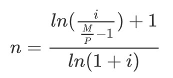

# Exercises

* based on:
    * https://www.r-exercises.com/
    * https://www.r-exercises.com/start-here-to-learn-r/

* have a look on the built-in datasets you use for practice!

```
# list built-in datasets
data()
```


# Objects

## Vectors

1. Suppose you have the two vectors: `u <- c(4, 5, 6)` and `v <- c(1, 2, 3)`. Provide the results for: Perform the following operations: add u and v, subtract v from u, multiply u by v, divide u by v, raise u to the power of v

2. R has lots of built-in datasets that we can use to practice. Have a look on the `rivers` data set (tip: just type `rivers` or `help(rivers)`). Check the following: a) number o elements; b) their sum, mean and median; c) the difference between the 10th and 28th observations; d) the mean of the ten highest observations; e) the standard deviation of the five lowest observations; f) the mean of all values, except the 67th observation; g) a random sample of 7 observations


> take this opportunity to compare the different functions for sorting data: `sort`, `rank` and `order`. Can you tell the difference between them?


## Factors

3. What are the levels in the factor variable `Species` in the `iris` dataset?


## Lists

4. If `p <- c(2,7,8)`, `q <- c("A", "B", "C")` and `x <- list(p, q)`, then what is the value of x[2]?

5. If `w <- c(2, 7, 8)`, `v <- c("A", "B", "C")`,and `x <- list(w, v)`, please replace "A" in `x` with "K"

6. If `a <- list ("x"=5, "y"=10, "z"=15)`, calculate the sum of the elements in a.

# Functions


7. Some functions accept multiple vectors as inputs. For example, the `cor` function accepts two vectors and returns their correlation coefficient. The `women` data “gives the average heights and weights for American women aged 30-39”. It contains two vectors: height and weight. a) Calculate the correlation between height and weight; Calculate the same correlation but now using the `spearman` method

8. Consider the following formula to calculate the number of mortgage payment terms:



In this equation, $M$ represents the monthly payment amount, $P$ the starting deposit, and $i$ the (monthly) interest rate. Please calculate the number of payment terms n for a mortgage with a principle balance of 200,000, monthly interest rate of 0.5%, and monthly payment amount of 2000.

> consider writing a function to do this calculation!

# Data Frames


9. Open one of the data frames in the folder `toy_expression_data.csv`. 1) Create a data frame with the mean expression of each gene across all patients; 2) Create a data frame with the variance of expression of each patient across all genes; 3) Calculate the fold change of expression in the comparison patient 1 vs patient 2; 4) If patient1 and patient 2 are controls and the others are cases, calculate the average fold-change in the comparison case vs control (tip: the expressions values are in `log`), 5) get the average expression values for cell cycle genes


# Loops and if-else statements

10. Write a while loop that prints out standard random normal numbers (use `rnorm()`) but stops (breaks) if you get a number bigger than 1.

11. Using a for loop simulate the flip a coin twenty times, keeping track of the individual outcomes (1 = heads, 0 = tails) in a vector that you preallocte.

12. Create a function that calculates the square root of a given integer vector x of length one, if the value contained in x is negative it should return NA.

13. Create a function that returns the amount of values that are larger than the mean of a vector

14. Given a numeric vector x with length 3, create a function that will print the elements by order from high to low.

15. Write a for loop that iterates over the column names of the inbuilt iris dataset and print each together with the number of characters in the column name in parenthesis. Example output: Sepal.Length (12). Use the following functions print(), paste() and nchar().


# Rosalind

* Rosalind is a platform for learning bioinformatics and programming through problem solving.
* http://rosalind.info/problems/list-view/


# Project

Explore and analyze a dataset

* R buil-in datasets
* https://www.kaggle.com/datasets
*
